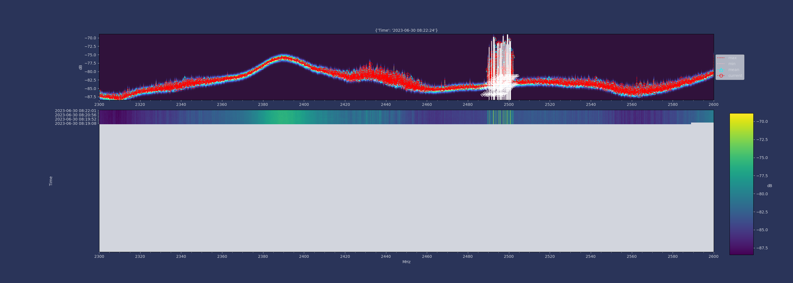

# gamutRF

An SDR orchestrated scanner and collector.

gamutRF is a system enabling a compact network of one or more modest machines (such as Pi4s), each with their own USB SDR (such as an Ettus
B200mini or a BladeRF XA9), to operate collectively as a configurable wideband scanner and I/Q sample recorder.

A gamutRF "orchestrator" machine can scan 0.1GHz to 6GHz in 30 seconds to identify signals, and then command potentially many gamutRF "workers" to make I/Q sample recordings for later analysis.

gamutRF provides tools to work with I/Q sample recordings, and to also record GPS location/compass metadata for the system itself. gamutRF typically runs on networks of Raspberry Pi4s, but can also run on x86 machines, and is based on gnuradio.

See also [instructions on how to build a gamutRF system](BUILD.md).

## Scanner theory of operation

gamutRF's scanner function is split across two Docker containers which are both run on the orchestrator. The `gamutrf` (scanner) container connects to the SDR and sweeps over a configured frequency range in 30s, while sampling at 8.192Msps (all default values which can be changed).

The samples are sent to a [streaming FFT gnuradio block](https://github.com/iqtlabs/gr-iqtlabs) which emits 2048 FFT points which are served over ZMQ to the `sigfinder` container (see below). The FFT block needs to know when the SDR has been retuned to a new frequency, so it uses a gnuradio timestamp and frequency tag provided by the gnuradio UHD driver upon retuning. This tag functionality has been added to the Soapy driver in a gnuradio fork which is part of gamutRF, so that other SDRs may be used as scanners.

The `sigfinder` container consumes these FFT points from ZMQ, does some noise processing (correcting FFT points to be in frequency order, computing mean power over 10kHz, and then a rolling mean over 1MHz) and then submits them to [scipy.signals.find_peaks](https://docs.scipy.org/doc/scipy/reference/generated/scipy.signal.find_peaks.html).

If workers have been provisioned, the orchestrator will then command the workers to make an approximately 10 second I/Q recording at approximately 20Msps of each signal. Each signal peak is assigned a 20MHz bin, which means that if a signal is repeatedly detected with some frequency variation, the assigned recording bin will be constant, and if multiple signals are detected within 20MHz they can be collected simultaneously. A worker by default records at a higher sample rate than the bin size, so that 20MHz signal margins can be recorded.

As there will almost certainly be more signals than workers available, the orchestrator will prioritize signals that it least often observed over a configurable number of scanner cycles. It is possible to configure this to `off` so that the recording choice will be random. It is also possible to configure the workers to tell the orchestrator to exclude that worker from certain frequency ranges (if for example the worker SDR cannot handle some part of the frequency spectrum scanned).

## Operating gamutRF

See the [build doc](BUILD.md)

### SDR/scanner/sigfinder command line options

While there are other options, these options primarily influence gamutRF's scanner functionality.

#### scanner

| Option | Description |
| -- | -- |
| --freq-start and --freq-end | Start and end of frequency range to scan in Hz (also used by sigfinger) |
| --igain | SDR input gain in dB |
| --samp-rate | Number of samples/sec |
| --sweep-sec | Time to sweep frequency range in seconds |
| --nfft | Number of FFT points |

##### sigfinder

| Option | Description |
| -- | -- |
| --width | Minimum width of a peak to be detected in 0.01MHz increments (passed to scipy find_peaks()) |
| --prominence | Minimum prominence of a peak to be detected (passed to scipy find_peaks()) |
| --threshold | Minimum threshold in dB of a peak to be detected (passed to scipy find_peaks()) |
| --bin_width | Bin width in MHz |
| --max_raw_power | Maximum valid raw power value at each FFT point |
| --history | Number of scanner cycles over which to prioritize recording of least often observed peaks |
| --record_bw_msps | Number of samples per second in units of 1024^2 (generally larger than bin size to record signal margins) |
| --record_secs | Length of time to record I/Q samples in seconds |
| --fftlog | Log raw output of CSV to this file, which will be rotated every --rotatesecs |
| --fftgraph | Graph the most recent FFT signal and peaks to this PNG file (will keep the last --nfftgraph versions) |

### Manually initiating worker actions

The orchestrator has a web interface on port 80. You can use this to command a worker to start an I/Q sample recording or start a RSSI stream.

## Working with worker I/Q recordings

Workers make recordings that are compressed with zstandard, and are typically in complex number, int16 format, and include the center frequency and sample rate that the recording was made with. gamutRF tools can generally work with such files directly, but other tools require the recordings to be converted (see below).

### Generating a spectrogram of a recording

gamutRF provides a tool to convert a recording or directory of recordings into a spectrogram. For example, to convert all I/Q recordings in /tmp:

```docker run -ti -v /tmp:/tmp iqtlabs/gamutrf gamutrf-specgram /tmp```

Use the ```--help``` option to change how the spectogram is generated (for example, to change the sample rate).

### Translating recordings to "gnuradio" format

Most SDR tools by convention take an uncompressed raw binary file as input, of [gnuradio type complex](https://blog.sdr.hu/grblocks/types.html). The user must explicitly specify to most SDR tools what sample rate the file was made at to correctly process it. gamutRF provides a tool that converts a gamutRF I/Q recording (which may be compressed) to an uncompressed binary file. For example:

```
docker run -v /tmp:/tmp -ti iqtlabs/gamutrf gamutrf-samples2raw /tmp/gamutrf_recording_ettus_directional_gain70_1234_100000000Hz_20971520sps.s16.zst
```

### Reviewing a recording interactively in gqrx

[gqrx](https://gqrx.dk/) is a multiplatform open source tool that allows some basic SDR operations like visualizing or audio demodulating an I/Q sample recording (see the [github releases page](https://github.com/gqrx-sdr/gqrx/releases), for a MacOS .dmg file). To use gqrx with a gamutRF recording, first translate the recording to gnuradio format (see above). Then open gqrx.

* Select ```Complex Sampled (I/Q) File```
* Set ```Input rate``` to be the same as the gamutRF sample rate (e.g. from the recording file name,
```gamutrf_recording_ettus_directional_gain70_1234_100000000Hz_20971520sps.raw```, set ```Input rate``` to 20971520, and also edit ```rate=``` in ```Device string``` to be 20971520)
* Set ``Bandwidth`` to 0
* Edit ```Device string``` to set the ```file=``` to be the path to the recording.
* Set ```Decimation``` to None.
* Finally select ```OK``` and then ```play``` from the gqrx interface to watch the recording play.

### Reducing recording sample rate

You may want to reduce the sample rate of a recording or re-center it with respect to frequency (e.g. to use another demodulator tool that doesn't support a high sample rate). gamutRF provides the ```freqxlator``` tool to do this.

* Translate your gamutRF recording to gnuradio format (see above).
* Use ```freqxlator``` to create a new recording at a lower sample rate, potentially with a different center frequency.

For example, to reduce a recording made with gamutRF's default sample rate to 1/10th the rate while adjusting the center frequency down by 1MHz, use:

```docker run -ti iqtlabs/gamutrf gamutrf-freqxlator --samp-rate 20971520 --center -1e6 --dec 10 gamutrf_recording_gain70_1234_100000000Hz_20971520sps.raw gamutrf_recording_gain70_1234_100000000Hz_2097152sps.raw```

### Demodulating AM/FM audio from a recording

gamutRF provides a tool to demodulate AM/FM audio from a recording as an example use case.

* Use the ```freqxlator``` tool to make a new recording at no more than 1Msps and has the frequency to be demodulated centered.
* Use the ```airspyfm``` tool to demodulate audio to a WAV file.

For example, to decode an FM recording which must be at the center frequency of a recording:

```docker run -v /tmp:/tmp -ti iqtlabs/gamutrf-airspyfm -m fm -t filesource -c filename=/tmp/gamutrf_recording_gain70_1234_100000000Hz_2097152sps.raw,raw,format=FLOAT,srate=2097152 -F /tmp/out.wav```

Run:

```docker run -ti iqtlabs/gamutrf-airspyfm -h```

To view other options.

## Scanner testing

Currently, the scanner ```gain``` and sigfinder ```threshold``` must be set manually for the general RF environment (e.g. noisy/many signals versus quiet/few signals).
To establish the correct values and to confirm the scanner is working, initiate a scan over the 2.2-2.6GHz range. As the 2.4GHz spectrum is very busy with legacy WiFi
and BlueTooth, the probability of seeing signals is high. If in an environment without BlueTooth or WiFi, an alternative is the FM broadcast band (88MHz to 108MHz).

To begin, commence scanning with just the scanner and sigfinder containers:

```
$ VOL_PREFIX=/tmp FREQ_START=2.2e9 FREQ_END=2.6e9 docker-compose -f orchestrator.yml up gamutrf sigfinder
```

Watch for ```/tmp/fft.png``` to appear, which should contain strong signals similar to this example:



If no or only small peaks appear which are not marked as peaks, increase ```gain``` (e.g., from 40 to 45) until peaks are detected.

If no peaks appear still, check antenna cabling, or choose a different scan range where signals are expected in your environment.

If peaks appear but are consistently not marked, decrease ```theshold``` (e.g. -25 to -35). If too many peaks are detected (noise detected as peaks), raise ```threshold.```

## Troubleshooting

#### Containers won't start using Ettus SDRs

You may see ```[ERROR] [USB] USB open failed: insufficient permissions``` on initial startup with Ettus SDRs. These devices download firmware and switch USB identities when first powered up. Restart the affected container to work around this.

#### "O"s or warnings about overflows in SDR containers

* Ensure your hardware can support the I/Q sample rate you have configured (gamutRF has been tested on Pi4 at 20Msps, which is the default recording rate). Also ensure your recording medium (e.g. flash drive, USB hard disk) is not timing out or blocking.
* If using a Pi4, make sure you are using active cooling and an adequate power supply (no CPU throttling), and you are using a "blue" USB3 port.

#### Scanner repeatedly logs "mean tuning step is greater than --samp-rate/2"

* ```--sweep-sec``` may be too low (fast), or ```--samp-rate``` may be too low, causing non-overlapping FFT windows between retuning points.
